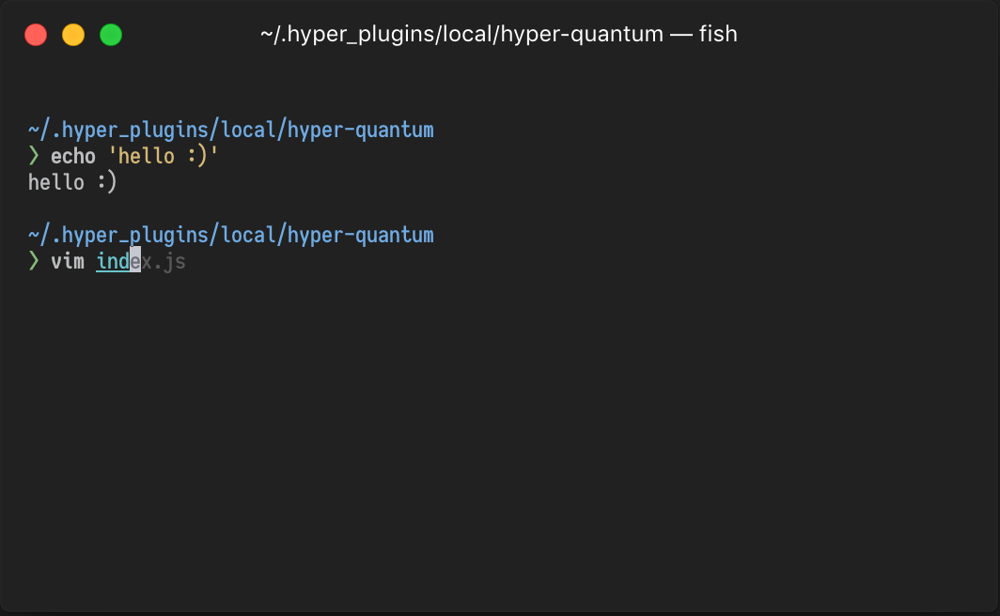

# Bringing a part of vim-quantum to hyper!

This is a port of the wonderful [vim-quantum-black](https://github.com/tyrannicaltoucan/vim-quantum) vim and terminal color scheme by [tyrannicaltoucan](https://github.com/tyrannicaltoucan) for [Hyper](https://hyper.is/)!



To install this, add `hyper-quantum-black` to your `.hyper.js`'s plugin section, like so:
```
plugins: [
  'hyper-quantum-black'
],
```
Lastly, reload/restart Hyper if it doesn't update by itself and you should be all set! :)

---

Font used in the screenshot: [Iosevka Term](https://github.com/be5invis/Iosevka)

I personally use [hyperterm-cursor](https://github.com/alvaropinot/hyperterm-cursor) so I can see what's underneath at all times
